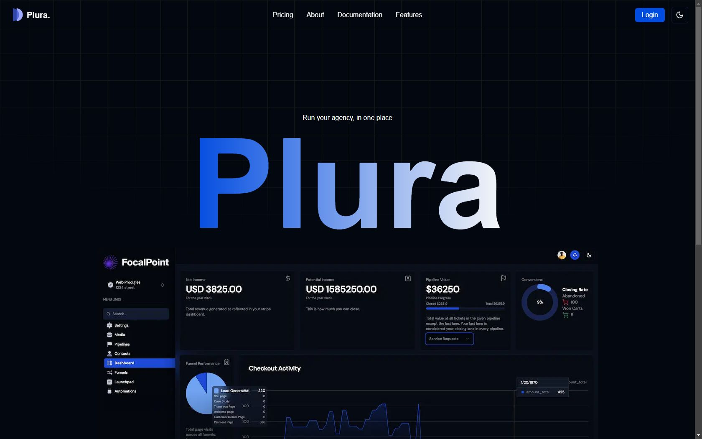

# **Agency Management System**

The Agency Management System is a feature-rich SaaS platform designed to streamline project workflows, manage sales funnels, and optimize client handling for agencies and businesses. The platform integrates tools like customizable dashboards, Kanban boards, and project management systems to deliver seamless and efficient operations. With multivendor B2B2B capabilities, role-based access controls, and Stripe integration for payments and subscriptions, it’s an all-in-one solution for businesses looking to scale effectively. Real-time notifications, performance metrics, and a light/dark mode interface further enhance user productivity and experience.

## **Key Features**

1. **Multivendor B2B2B SaaS:** Enables businesses to operate in a network where services can flow across multiple vendors seamlessly.
2. **Agency and Sub-Accounts:** Allows agencies to manage primary and sub-accounts with delegated tasks and responsibilities.
3. **Unlimited Funnel Hosting:** Create and host unlimited sales funnels for lead capture, education, and sales.
4. **Full Website & Funnel Builder:** Drag-and-drop tools for building professional websites and marketing funnels.
5. **Role-Based Access Control (RBAC):** Secure and customizable permissions for platform users.
6. **Stripe Integration:** Supports subscription plans, add-on products, and recurring payments through Stripe.
7. **Custom Dashboards:** Display key metrics tailored to user needs, such as sales, leads, and project statuses.
8. **Kanban Board:** Visualize and manage tasks across different project stages.
9. **Project Management System:** Collaborate, assign tasks, track progress, and meet deadlines with ease.
10. **Media Storage:** Upload and manage rich media files for projects and marketing.
11. **Custom Checkouts:** Create branded and personalized checkout pages for products and services.
12. **Funnel Performance Metrics:** Track and optimize sales funnels with detailed performance insights.
13. **Light & Dark Modes:** Choose between light and dark themes for enhanced usability.

## **Who is it for?**

- **Agencies:** Manage multiple clients, projects, and sales funnels efficiently.
- **Businesses:** Streamline operations and drive growth with centralized management tools.
- **Multivendor Environments:** Handle complex vendor relationships with integrated solutions.

## **Technologies Used**

- **Frontend:** React.js, Next.js, Tailwind CSS, Shadcn/UI.
- **Backend:** Prisma, Next.js APIs.
- **Database:** PostgreSQL.
- **State Management:** Zustand.
- **Authentication:** Clerk.
- **Integration:** Stripe Connect.
- **Deployment:** Vercel.

## **Why Use This Platform?**

- **Streamlined Operations:** Consolidate workflows with integrated tools.
- **Customizable:** Tailored dashboards, role-based access, and design elements for flexibility.
- **Scalable:** Suitable for agencies and businesses of any size.
- **Real-Time Insights:** Stay updated with metrics, notifications, and analytics.

---

## **Live Demo**

Check out the live demo: [Plura SaaS](https://plurasaasproduction.vercel.app/)

## **Conclusion**

The Agency Management System redefines how businesses manage projects, clients, and sales funnels. With its robust features and cutting-edge technology, it’s the ultimate solution for agencies and businesses aiming to scale their operations efficiently and effectively.
